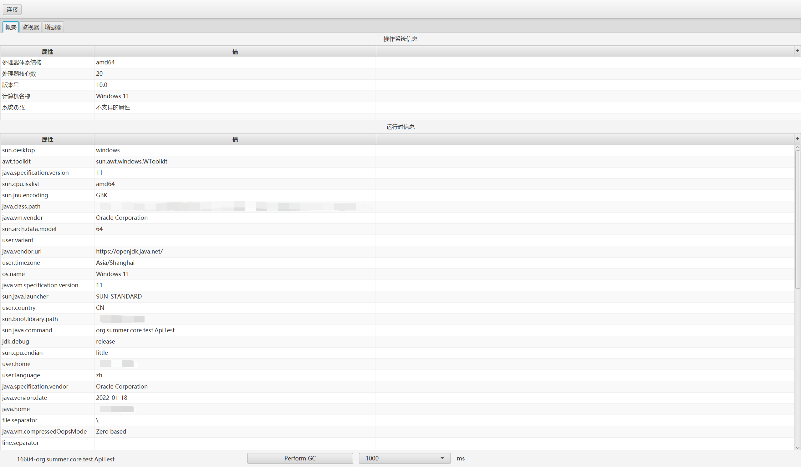
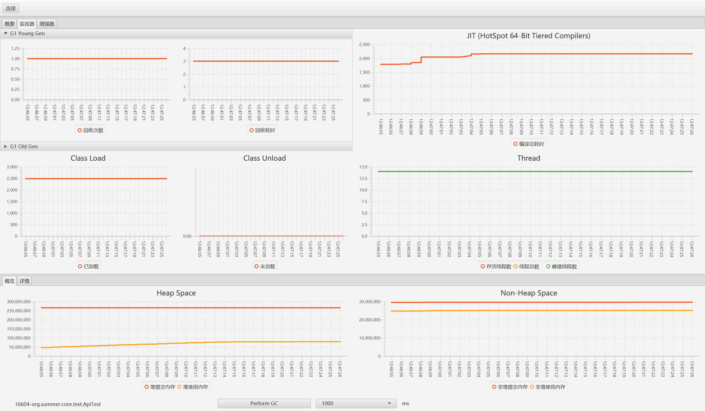
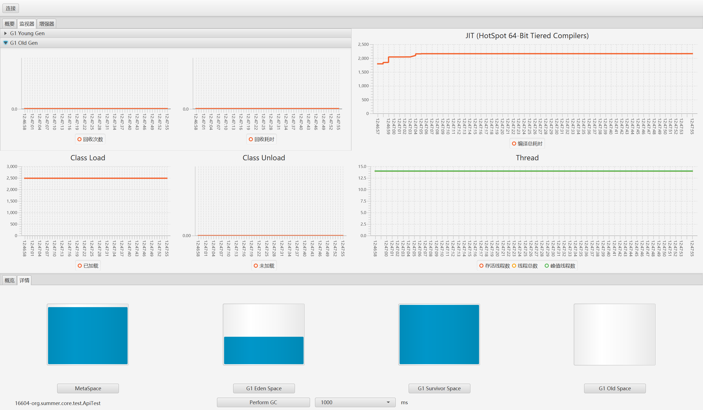
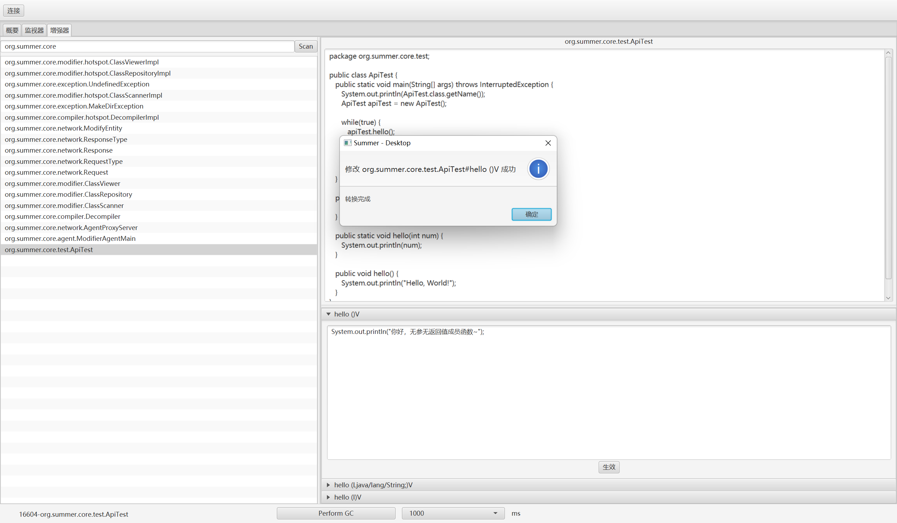

# Summer
Java 运行时字节码增强分析工具

## 1. core
Summer 项目的核心，包含所有功能的具体实现
 
### 1.1 功能概览

1. [x] 探测本机运行的虚拟机
2. [x] 附着指定虚拟机
3. [x] 获取虚拟机系统参数、变量
4. [x] 定时获取虚拟机内存状况、线程状况、JIT、类加载和垃圾收集状况
5. [x] “强制”触发垃圾回收
6. [x] 扫描指定包下已加载的可修改类
7. [x] 反编译指定类
8. [x] 扫描类下可修改的方法
9. [x] 动态修改类的方法， **Javassist** 语法
10. [x] 获取增强后的类反编译结果
11. [ ] 监控系统CPU负载
12. [ ] 动态添加虚拟机参数
13. [ ] Heap Dump
14. [ ] Thread Dump
15. [ ] 动态切换监控的虚拟机

## 2. summer-desktop
Summer 项目 JavaFX 的桌面版本实现

## 演示

